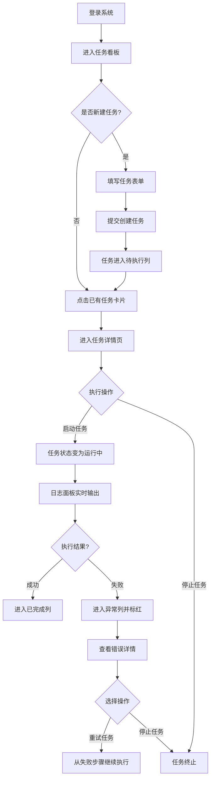

## 1. 产品概述

AgentOps AI Agent 自动作业平台是一个面向企业运维团队的 AI Agent 任务编排与监控系统，用于统一管理多 Agent 协作任务的创建、调度、执行与追踪。平台解决了 AI Agent 任务分散、状态不可视、异常难定位的核心痛点，目标是让运维人员通过可视化界面完成 Agent 作业全生命周期管理。

## 2. 核心功能

### 2.1 用户角色

| 角色 | 注册方式 | 核心权限 |
|------|---------|---------|
| 平台管理员 | 系统预置 | 用户管理、全局配置、任务审计、查看所有任务 |
| 运维操作员 | 管理员创建 | 创建任务、启动/停止任务、查看任务详情、处理异常 |
| 只读观察者 | 管理员创建 | 查看任务看板、任务详情和运行日志，无操作权限 |

### 2.2 功能模块

1. **任务看板视图**：按状态分组的任务卡片看板（待执行/运行中/已完成/异常），支持拖拽交互
2. **任务详情视图**：任务基本信息、执行步骤、运行日志、Agent 状态面板
3. **Agent 管理面板**：Agent 列表、在线状态、角色配置、资源占用

### 2.3 页面详情

| 页面名称 | 模块名称 | 功能描述 |
|---------|---------|-----------|
| 任务看板页 | 顶部导航栏 | 角色切换、全局搜索、用户信息下拉菜单 |
| 任务看板页 | 状态列分组 | 4 列任务状态看板（待执行/运行中/已完成/异常），每列显示任务卡片数量和状态图标 |
| 任务看板页 | 任务卡片 | 显示任务名称、负责人、优先级、进度条、创建时间，点击进入详情 |
| 任务看板页 | 新建任务按钮 | 弹出创建任务表单，填写任务名称、描述、选择 Agent、设置优先级 |
| 任务详情页 | 任务信息面板 | 展示任务 ID、状态标签、优先级、负责人、创建/更新时间 |
| 任务详情页 | 执行步骤列表 | 步骤序号、步骤名称、执行状态、耗时、错误信息展开 |
| 任务详情页 | 实时日志面板 | 滚动输出运行日志，支持等级过滤（INFO/WARN/ERROR） |
| 任务详情页 | 操作栏 | 启动任务、停止任务、重试任务、返回看板四个动作按钮 |
| Agent 管理页 | Agent 列表表格 | Agent 名称、角色标签、在线状态、CPU/内存使用率、心跳时间 |
| Agent 管理页 | 角色配置区 | 角色卡片展示、权限矩阵勾选、保存配置按钮 |

## 3. 核心流程

### 3.1 主要用户流程描述

运维操作员登录后进入任务看板，浏览各状态任务分布。点击"新建任务"按钮，填写任务表单并选择执行 Agent 后提交，任务进入"待执行"列。操作员点击任务卡片进入详情页，查看执行步骤规划后点击"启动任务"，任务状态变为"运行中"，日志面板开始实时输出。若某步骤失败，任务自动转入"异常"列并标红，操作员可查看错误详情后点击"重试任务"从失败步骤继续执行，或点击"停止任务"终止执行。任务完成后自动进入"已完成"列。

### 3.2 Mermaid 流程图

## 4. 用户界面设计

### 4.1 设计风格

- **主色调**：深空蓝 `#1e293b` 作为背景主色，搭配科技感的青色渐变 `#06b6d4 → #3b82f6` 作为品牌强调色
- **辅助色**：状态色区分 —— 绿色 `#22c55e`（成功/在线）、琥珀色 `#f59e0b`（运行中/待执行）、红色 `#ef4444`（异常/离线）、灰色 `#64748b`（已完成/停止）
- **按钮风格**：圆角 6px，主按钮带青色渐变背景与微妙的 hover 上浮阴影；次级按钮为描边样式
- **字体**：使用 JetBrains Mono 等宽字体展示代码和日志，Inter 作为正文 UI 字体
- **布局风格**：深色科技控制台风格，左侧导航 + 主内容区双栏布局，任务看板采用卡片网格列布局
- **图标风格**：简洁线性图标，使用 Lucide 图标库，状态图标使用实心色块背景 + 白色符号

### 4.2 页面设计概览

| 页面名称 | 模块名称 | UI 元素 |
|---------|---------|---------|
| 任务看板页 | 顶部导航栏 | 深色背景、Logo 渐变文字、搜索框（圆角发光效果）、角色切换下拉、用户头像 |
| 任务看板页 | 状态列分组 | 列标题带状态色左边框、卡片数量徽章、背景使用极浅的状态色透明度叠加 |
| 任务看板页 | 任务卡片 | 深色卡片、悬停时边框发光、左侧优先级色条、进度条渐变填充 |
| 任务详情页 | 任务信息面板 | 状态大标签（带脉冲动画）、信息键值对网格、快速操作按钮组 |
| 任务详情页 | 执行步骤列表 | 步骤时间线布局、成功打勾/失败打叉图标、失败项展开红色错误详情面板 |
| 任务详情页 | 实时日志面板 | 黑色背景终端风格、行号显示、不同日志等级不同颜色文字、自动滚动到底部 |
| Agent 管理页 | Agent 列表表格 | 斑马行纹、在线状态带呼吸点动画、资源使用率进度条 |
| Agent 管理页 | 角色配置区 | 角色卡片（带渐变边框）、权限矩阵复选框网格 |

### 4.3 响应式设计

- 桌面端优先设计，最小支持宽度 1280px
- 任务看板在 1440px 以下自动调整为横向滚动布局
- 左侧导航在平板尺寸折叠为图标模式
- 任务详情页的执行步骤和日志面板在窄屏下切换为上下堆叠布局

### 4.4 微交互与动画

- 任务卡片 hover 时有 2px 上浮 + 青色发光边框效果
- "运行中"状态标签带呼吸脉冲动画
- 任务状态切换时有平滑的卡片滑动过渡
- 日志面板新行出现时从左侧淡入滑入
- 按钮点击时有 0.95 缩放的按下反馈
- 全局页面切换使用淡入淡出过渡
