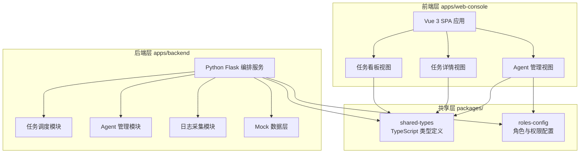
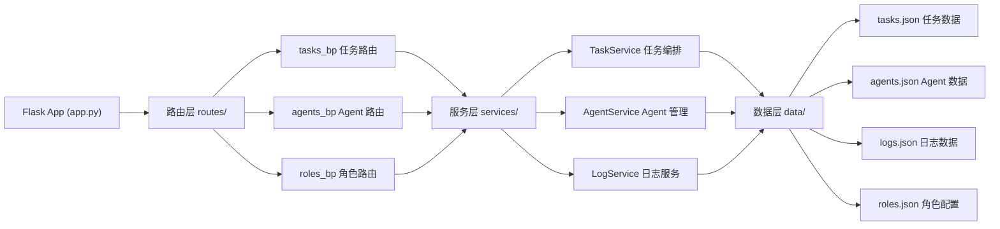
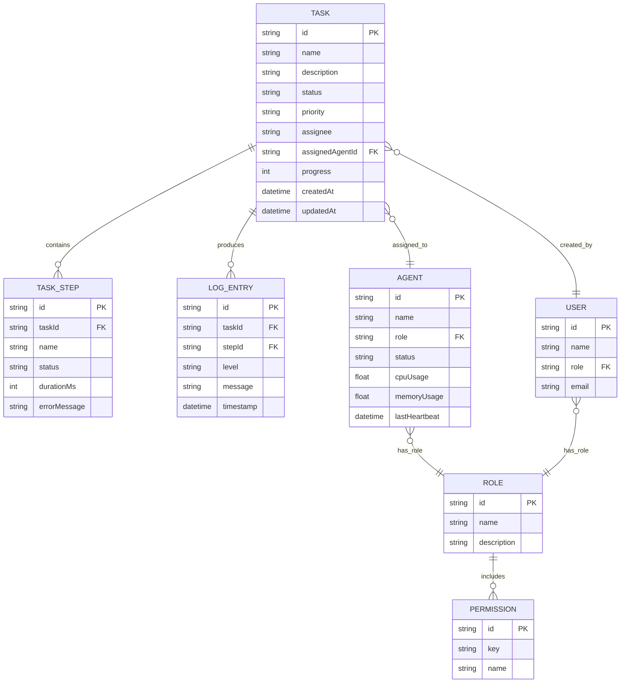

## 1. 架构设计



## 2. 技术选型说明

- **前端**：Vue 3 (Composition API) + TypeScript + Vite 5 + Tailwind CSS 3 + Vue Router 4
- **初始化工具**：Vite 官方脚手架 (vue-ts 模板)
- **后端**：Python 3.10+ + Flask 3（轻量级、零配置、依赖极少）
- **状态管理**：Vue 3 内置 reactive + provide/inject（不引入额外状态管理库）
- **HTTP 通信**：前端使用原生 fetch API，后端 Flask 提供 RESTful JSON API
- **数据持久化**：本地 JSON 文件模拟（apps/backend/data/*.json），无需数据库
- **图标库**：lucide-vue-next（Vue 版 Lucide 图标）

## 3. 路由定义

| 路由路径 | 页面组件 | 用途说明 |
|---------|---------|---------|
| `/` | DashboardPage | 任务看板首页，四列状态看板 |
| `/task/:taskId` | TaskDetailPage | 任务详情页，步骤与日志 |
| `/agents` | AgentsPage | Agent 管理与角色配置 |
| `*` | NotFoundPage | 404 页面 |

## 4. API 接口定义

### 4.1 TypeScript 共享类型定义（位于 packages/shared-types）

```typescript
export type TaskStatus = 'pending' | 'running' | 'completed' | 'error' | 'stopped';

export type TaskPriority = 'low' | 'medium' | 'high' | 'critical';

export type LogLevel = 'INFO' | 'WARN' | 'ERROR' | 'DEBUG';

export type AgentStatus = 'online' | 'offline' | 'busy' | 'idle';

export type UserRole = 'admin' | 'operator' | 'viewer';

export interface TaskStep {
  id: string;
  name: string;
  status: 'pending' | 'running' | 'completed' | 'error' | 'skipped';
  startedAt?: string;
  finishedAt?: string;
  durationMs?: number;
  errorMessage?: string;
}

export interface LogEntry {
  id: string;
  timestamp: string;
  level: LogLevel;
  message: string;
  taskId: string;
  stepId?: string;
}

export interface Agent {
  id: string;
  name: string;
  role: string;
  status: AgentStatus;
  cpuUsage: number;
  memoryUsage: number;
  lastHeartbeat: string;
  capabilities: string[];
}

export interface Task {
  id: string;
  name: string;
  description: string;
  status: TaskStatus;
  priority: TaskPriority;
  assignee: string;
  assignedAgentId?: string;
  steps: TaskStep[];
  progress: number;
  createdAt: string;
  updatedAt: string;
  startedAt?: string;
  finishedAt?: string;
  errorMessage?: string;
}

export interface RolePermission {
  role: UserRole;
  roleName: string;
  description: string;
  permissions: string[];
}

export interface ApiResponse<T> {
  success: boolean;
  data?: T;
  error?: string;
  message?: string;
}
```

### 4.2 RESTful API 列表

| 方法 | 路径 | 请求参数 | 返回类型 | 说明 |
|-----|------|---------|---------|------|
| GET | `/api/tasks` | status?: string | `ApiResponse<Task[]>` | 获取任务列表，可选按状态过滤 |
| GET | `/api/tasks/:taskId` | - | `ApiResponse<Task>` | 获取单个任务详情 |
| POST | `/api/tasks` | body: `{name, description, priority, assignedAgentId}` | `ApiResponse<Task>` | 创建新任务 |
| POST | `/api/tasks/:taskId/start` | - | `ApiResponse<Task>` | 启动任务 |
| POST | `/api/tasks/:taskId/stop` | - | `ApiResponse<Task>` | 停止任务 |
| POST | `/api/tasks/:taskId/retry` | - | `ApiResponse<Task>` | 重试失败任务 |
| GET | `/api/tasks/:taskId/logs` | level?: string | `ApiResponse<LogEntry[]>` | 获取任务日志 |
| GET | `/api/agents` | - | `ApiResponse<Agent[]>` | 获取 Agent 列表 |
| GET | `/api/roles` | - | `ApiResponse<RolePermission[]>` | 获取角色与权限配置 |
| PUT | `/api/roles/:roleName` | body: `{permissions: string[]}` | `ApiResponse<RolePermission>` | 更新角色权限 |

## 5. 后端服务架构



## 6. 数据模型

### 6.1 ER 关系图



### 6.2 Monorepo 目录结构

```
agentops-ai-agentmonorepoweb/
├── .trae/
│   └── documents/
│       ├── PRD.md
│       └── architecture.md
├── packages/                          # 共享包
│   ├── shared-types/                  # 共享类型定义
│   │   ├── src/
│   │   │   └── index.ts              # TypeScript 类型导出
│   │   ├── package.json
│   │   └── tsconfig.json
│   └── roles-config/                  # 角色与权限配置
│       ├── src/
│       │   └── roles.json            # 角色权限配置数据
│       └── package.json
├── apps/                              # 应用层
│   ├── web-console/                   # Vue Web 控制台
│   │   ├── src/
│   │   │   ├── components/           # 组件
│   │   │   │   ├── TaskCard.vue
│   │   │   │   ├── TaskColumn.vue
│   │   │   │   ├── StepTimeline.vue
│   │   │   │   ├── LogPanel.vue
│   │   │   │   ├── StatusBadge.vue
│   │   │   │   └── AgentRow.vue
│   │   │   ├── views/                # 页面视图
│   │   │   │   ├── DashboardPage.vue
│   │   │   │   ├── TaskDetailPage.vue
│   │   │   │   └── AgentsPage.vue
│   │   │   ├── composables/          # 组合式函数
│   │   │   │   ├── useTasks.ts
│   │   │   │   ├── useAgents.ts
│   │   │   │   └── useRoles.ts
│   │   │   ├── api/                  # API 请求层
│   │   │   │   ├── client.ts
│   │   │   │   ├── tasks.ts
│   │   │   │   ├── agents.ts
│   │   │   │   └── roles.ts
│   │   │   ├── router/
│   │   │   │   └── index.ts
│   │   │   ├── App.vue
│   │   │   ├── main.ts
│   │   │   └── style.css
│   │   ├── index.html
│   │   ├── vite.config.ts
│   │   ├── tailwind.config.js
│   │   ├── postcss.config.js
│   │   ├── tsconfig.json
│   │   └── package.json
│   └── backend/                       # Python Flask 后端
│       ├── app.py                    # Flask 应用入口
│       ├── routes/                   # 路由层
│       │   ├── tasks.py
│       │   ├── agents.py
│       │   └── roles.py
│       ├── services/                 # 业务服务层
│       │   ├── task_service.py
│       │   ├── agent_service.py
│       │   └── log_service.py
│       ├── data/                     # 本地 Mock JSON 数据
│       │   ├── tasks.json
│       │   ├── agents.json
│       │   ├── logs.json
│       │   └── roles.json
│       ├── requirements.txt
│       └── run.py                    # 启动脚本
├── scripts/
│   ├── start-dev.ps1                 # Windows 一键启动
│   └── start-dev.sh                  # macOS/Linux 一键启动
├── package.json                      # Monorepo 根 package.json (npm workspaces)
├── tsconfig.base.json                # 共享 TypeScript 配置
└── README.md
```
